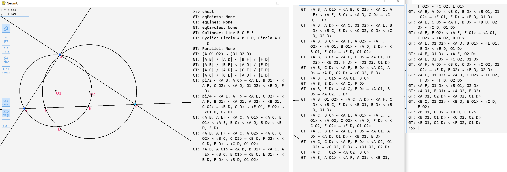

# GeomTool

## Introduction
 `GeomTool` is a [GeoGebra](https://github.com/geogebra/geogebra) like tool designed for Euclidean Geometry studying based on `python` and [pygame](https://github.com/pygame/pygame) (for user interface), with extra functions such as automatic property searching and theorem proving. 
 
 Our aim is: Geometry For Everyone. 

 

## How to Use?
 Make sure you have `pygame` package in your python and just run `UI.py`. 
 
 There is also a command line in the UI. You can use keyboard to input constructions, save and run files, and search for geometric properties by an automatic check. Use `help` in the command line to see detailed help for instructions. 
